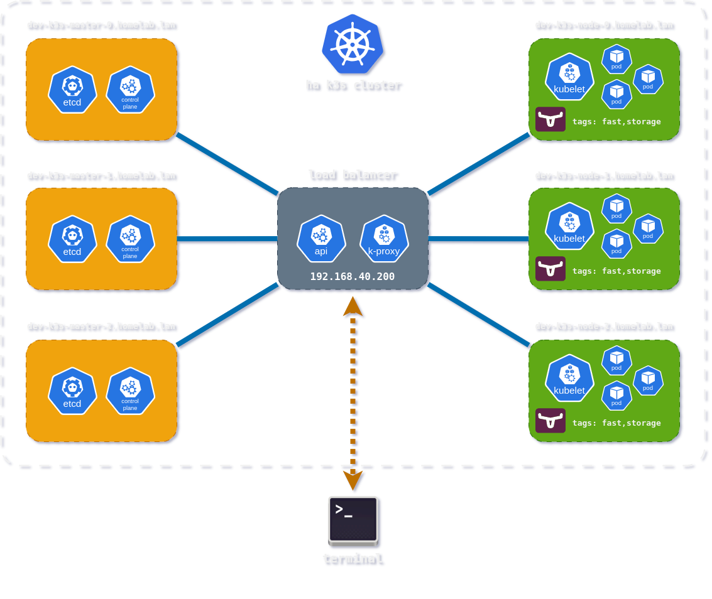

# About the project

The [k3s-ansible](https://github.com/JacekZubielik/k3s-ansible) repository is a fork of the project [techno-tim/k3s-ansible](https://github.com/techno-tim/k3s-ansible) that allows you to automatically run highly available clusters using `Ansible` and `k3s` along with `MetalLB`, `Flannel`, `Calico`, `Cilium` or `Kube-VIP` of your choice on hybrid **x86\/ARM** nodes.

This release of the repository adds `Makefile` and new **Ansible** playbooks, which is a comprehensive solution for preparing the **Kubernetes** environment:

- Update and upgrade the **Debian** operating system, managing services and installing packages on each node.

- Integration with **Apt-Cacher**, which acts as a proxy cache for Debian packages.

- Preparation for **Longhorn** deployment, creating partitions, configuring the filesystem, checking requirements, and **labelling** and **annotating** the relevant nodes in the cluster.

- Redundant code removed (Proxmox LCX support, Proxy, etc.).



## Related repositories

The project consists of multiple repositories, deployment is fully automated, the cluster can be redeployed in minutes as many times as required.

Please check the following repository for more information:

| Name                  | Description                                                              |
| --------------------- | ------------------------------------------------------------------------ |
| [k3s-ansible](https://github.com/JacekZubielik/k3s-ansible)          | Automated build of HA k3s cluster with kube-vip and MetalLB via ansible. |
| [dev-k3s-lab-autopilot](https://github.com/JacekZubielik/dev-k3s-lab-autopilot) | Deploying applications to the clusters with  ArgoCD Autopilot.           |
| [jz-helm-charts](https://github.com/JacekZubielik/jz-helm-charts)        | Personal Helm charts for applications deployed to the clusters           |

[](https://odysee.com/$/embed/@dev-k3s-lab-autopilot:6/k3s-ansible:9?r=2exiFW5MjKi3cxzuB8VRhiE6E8khvcP8)

# Preparation for Installation

You can provision **virtual machines** or **bare metal**, as well as a mix of these solutions.

In the case of **bare metal**, you need to provide a physical data medium for each **node** designated to operate as `[storage_servers]`.

## **File Editing**: `hosts.ini`

```ini
[master]
dev-k3s-master-0.homelab.lan node_name=dev-k3s-master-0
dev-k3s-master-1.homelab.lan node_name=dev-k3s-master-1
dev-k3s-master-2.homelab.lan node_name=dev-k3s-master-2

[node]
dev-k3s-node-0.homelab.lan node_name=dev-k3s-node-0
dev-k3s-node-1.homelab.lan node_name=dev-k3s-node-1
dev-k3s-node-2.homelab.lan node_name=dev-k3s-node-2

[k3s_cluster:children]
master
node

[storage_servers]
dev-k3s-node-0.homelab.lan
dev-k3s-node-1.homelab.lan
dev-k3s-node-2.homelab.lan
```

## **File Editing**: `all.yml`

Applied a solution that provides a virtual **IP** address for the `Kubernetes` platform and a `load balancer` module for both the control plane and Kubernetes services. This way, we can have a single IP address (`192.168.40.200`) that can be used by all three masters. In the event of a failure of one, we can still communicate with the others without needing to change the IP address in the `kubeconfig` file.

`inventory/my-cluster/group_vars/all.yml`

```yaml
# apiserver_endpoint is virtual ip-address which will be configured on each master
apiserver_endpoint: "192.168.40.200"
```

Uncomment the appropriate entry to select the **CNI** for your deployment.

```bash
# uncomment cilium_iface to use cilium cni instead of flannel or calico
cilium_iface: "eth0"
```

```bash
# interface which will be used for flannel
# flannel_iface: eth0
```

```bash
# uncomment calico_iface to use tigera operator/calico cni instead of flannel https://docs.tigera.io/calico/latest/about
# calico_iface: eth0
```

## **File Editing**: `ansible.cfg`

This configuration file is tailored for a testing environment with optimizations like pipelining and fact caching while disabling some security features that are typically recommended in production settings.

The server and agent nodes must have SSH access configured without a password.

```ini
[defaults]
ansible_python_interpreter = .venv/bin/python
callback_result_format = yaml
callbacks_enabled = profile_tasks
collections_path = ./collections:/usr/share/ansible/collections
fact_caching = jsonfile
fact_caching_connection = ./inventory/cache
fact_caching_timeout = 86400
forks = 5
gathering = smart
hash_behaviour = merge
inventory = ./inventory/hosts.ini
local_tmp = .ansible/tmp
log_path = ./ansible.log
pipelining = True
remote_tmp = .ansible/tmp
roles_path = ./roles:/usr/share/ansible/roles
stdout_callback = yaml
timeout = 60
vault_password_file = ~/.vault/vault_passphrase.gpg

[ssh_connection]
ansible_ssh_private_key_file = ~/.ssh/id_rsa
control_path = %(directory)s/%%h-%%r
pipelining = true
retries = 3
scp_if_ssh = smart
ssh_args = -o ControlMaster=auto -o ControlPersist=30m -o Compression=yes -o ServerAliveInterval=15s
```

## The Role of `packages_debian`

The role of `packages_debian` is to update and modernize the Debian system by installing packages, configuring files, and managing services.


## The Role of `longhorn_util`

This playbook automates the process of creating partitions, configuring the file system, and mounting it in Linux, which is crucial for preparing the environment for Longhorn installation. As a result, the entire process is repeatable and easy to manage.

### Disable swap memory

```yaml
- name: Disable swap memory
  include_tasks: disable_swap.yml
```

### Creating a Partition on the Disk

In this step, the parted module is used to create one large partition on the disk `/dev/vda`, which occupies all available space (from 0% to 100% of the disk).

```yaml
- name: "Create single large partition filling the disk for fast disk"
  ansible.builtin.command: >
    parted /dev/vda -- mkpart primary 0% 100%
  when: "'1' not in (debug_disk_info_fast.stdout | regex_findall('^ 1'))"
  ignore_errors: true

- name: "Create single large partition filling the disk for slow disk"
  ansible.builtin.command: >
    parted /dev/vdb -- mkpart primary 0% 100%
  when: "'1' not in (debug_disk_info_slow.stdout | regex_findall('^ 1'))"
  ignore_errors: true
```

### Creating a File System

The aim of this task is to create an `ext4` file system on the device `/dev/vda1` and `/dev/vdb1`, provided that certain conditions are met. This allows for the preparation of disk space for applications such as Longhorn, which require an appropriate file structure.

```yaml
- name: "Check if filesystem already exists on the partition for fast disk"
  ansible.builtin.command: blkid -o value -s TYPE /dev/vda1
  register: filesystem_check_fast
  ignore_errors: true
  changed_when: false

- name: "Create filesystem on new partition for fast disk"
  ansible.builtin.command: mkfs.ext4 -L fast /dev/vda1
  when: filesystem_check_fast.stdout != "ext4"

- name: "Check if filesystem already exists on the partition for slow disk"
  ansible.builtin.command: blkid -o value -s TYPE /dev/vdb1
  register: filesystem_check_slow
  ignore_errors: true
  changed_when: false

- name: "Create filesystem on new partition for slow disk"
  ansible.builtin.command: mkfs.ext4 -L slow /dev/vdb1
  when: filesystem_check_slow.stdout != "ext4"
```

The results of the command are displayed using the `debug` module, which allows you to see if the label has been correctly assigned.

```log
TASK [longhorn_util : debug] ************************************************************************************************************************************************************************************
Sunday 01 December 2024  00:03:06 +0100 (0:00:00.170)       0:00:20.568 *******
ok: [dev-k3s-node-0.homelab.lan] =>
  result.stdout_lines:
  - NAME    LABEL
  - 'sda     '
  - '├─sda1  '
  - '├─sda14 '
  - '└─sda15 '
  - 'vda     '
  - └─vda1  data
ok: [dev-k3s-node-1.homelab.lan] =>
  result.stdout_lines:
  - NAME    LABEL
  - 'sda     '
  - '├─sda1  '
  - '├─sda14 '
  - '└─sda15 '
  - 'vda     '
  - └─vda1  data
ok: [dev-k3s-node-2.homelab.lan] =>
  result.stdout_lines:
  - NAME    LABEL
  - 'sda     '
  - '├─sda1  '
  - '├─sda14 '
  - '└─sda15 '
  - 'vda     '
  - └─vda1  data
```

## Creating a Mount Point Directory
This step creates the directory `/mnt/data`, which will be used as a mount point for the new file system.

```yaml
- name: "Create directory /mnt/fast"
  ansible.builtin.file:
    path: /mnt/fast
    state: directory
    mode: '0777'
    owner: nobody
    group: nogroup

- name: "Ensure /mnt/fast directory exists"
  ansible.builtin.file:
    path: /mnt/fast
    state: directory
    mode: '0777'
    owner: nobody
    group: nogroup
  when: not ansible_facts.mounts | selectattr('mount', 'equalto', '/mnt/fast') | list

- name: "Create directory /mnt/slow"
  ansible.builtin.file:
    path: /mnt/slow
    state: directory
    mode: '0777'
    owner: nobody
    group: nogroup

- name: "Ensure /mnt/slow directory exists"
  ansible.builtin.file:
    path: /mnt/slow
    state: directory
    mode: '0777'
    owner: nobody
    group: nogroup
  when: not ansible_facts.mounts | selectattr('mount', 'equalto', '/mnt/slow') | list
```

## Role of `longhorn_labels`

This code is used to verify the prerequisites for **Longhorn** and serves as a comprehensive solution for preparing the Kubernetes environment for Longhorn by **labeling** and **annotating** the appropriate nodes marked as [storage_servers] in the Kubernetes cluster.

### Labeling of Storage Nodes

This task applies the label `node.longhorn.io/create-default-disk=config` to all `storage nodes`, informing Longhorn that default disks are to be created.

```yaml
- name: "Apply label create-default-disk=config on storage nodes"
  ansible.builtin.command:
    kubectl label nodes {{ hostvars[item].node_name }}
    node.longhorn.io/create-default-disk=config --overwrite
  register: label_check
  changed_when: "'already has' not in label_check.stdout"
  loop: "{{ hostvars[inventory_hostname]['groups']['storage_servers'] }}"
```

The annotation indicates that the nodes are intended for fast data storage.

```yaml
- name: "Apply annotation default-node-tags=fast,storage on storage nodes"
  ansible.builtin.command:
    kubectl annotate nodes {{ hostvars[item].node_name }}
    node.longhorn.io/default-node-tags='["fast","storage"]' --overwrite
  register: annotation_check
  changed_when: "'already has' not in annotation_check.stdout"
  loop: "{{ hostvars[inventory_hostname]['groups']['storage_servers'] }}"
```

This task labels nodes as intended for use by **Longhorn**.

```yaml
- name: "Apply label storage=longhorn on storage nodes"
  ansible.builtin.command:
    kubectl label nodes {{ hostvars[item].node_name }}
    storage='longhorn' --overwrite
  register: label_check
  changed_when: "'already has' not in label_check.stdout"
  loop: "{{ hostvars[inventory_hostname]['groups']['storage_servers'] }}"
```

This task sets the `default disk` configuration for **Longhorn**, defining parameters such as the path, whether to allow scheduling, and specifying the size of reserved memory.

```yaml
- name: "Apply annotation default-disks-config for data and database on storage nodes"
  ansible.builtin.command:
    cmd: >
      kubectl annotate nodes {{ hostvars[item].node_name }}
      node.longhorn.io/default-disks-config='[{"name":"fast","path":"/mnt/fast","allowScheduling":true,
      "storageReserved":4294967296,"tags":["fast"]},{"name":"slow","path":"/mnt/slow","allowScheduling":true,
      "storageReserved":4294967296,"tags":["slow"]}]' --overwrite
  register: annotation_check
  changed_when: "'already has' not in annotation_check.stdout"
  loop: "{{ hostvars[inventory_hostname]['groups']['storage_servers'] }}"

```

The task removes the default flag `local-path`.

```yaml
- name: "Remove the default flag from the local-provisioner if it's set to true"
  ansible.builtin.command:
    kubectl patch storageclass local-path -p
    '{"metadata":{"annotations":{"storageclass.kubernetes.io/is-default-class":"false"}}}'
  when: (storage_class_flag.stdout | default('false')) == 'true'
  register: patch_result
  changed_when: '"unchanged" not in patch_result.stderr'
```

## Compliance Check Script

This script checks the environment for compliance with Longhorn requirements.

```yaml
- name: "Download the preconfig script"
  ansible.builtin.get_url:
    url: "https://raw.githubusercontent.com/longhorn/longhorn/v1.8.1/scripts/environment_check.sh"
    dest: "/tmp/environment_check.sh"
    mode: '0755'
  register: script_download

- name: "Run the preconfig script"
  ansible.builtin.command:
    cmd: "/tmp/environment_check.sh"
  register: script_check
  loop: "{{ hostvars[inventory_hostname]['groups']['storage_servers'] }}"

```

This task displays the results of a check script.

```yaml
- name: "Print script output"
  ansible.builtin.debug:
    msg: "{{ item.stdout if item.stdout is defined else 'No output or script failed' }}"
  loop: "{{ script_check.results }}"
```

### Labeling Worker Nodes

This task labels all nodes as worker nodes.

```yaml
- name: "Apply label node-role.kubernetes.io/worker=worker"
  ansible.builtin.command:
    kubectl label nodes {{ hostvars[item].node_name }}
    node-role.kubernetes.io/worker='worker' --overwrite
  register: label_check
  changed_when: "'already has' not in label_check.stdout"
  loop: "{{ hostvars[inventory_hostname]['groups']['node'] }}"
```

## Create a directory for containerd configuration

The Ansible role plays a crucial role in managing the configuration of a containerd-based environment within a K3s cluster. Its primary purpose is to set up the necessary directories and configuration files on the cluster nodes, enabling secure and efficient use of a local Docker Hub registry mirror. The first task creates a directory for containerd configuration with appropriate permissions, laying the groundwork for subsequent steps. Next, a subdirectory is established for registry-specific certificates, ensuring a secure storage location for authentication data. The third task decrypts and copies a CA certificate to the nodes using Ansible Vault, safeguarding sensitive information and triggering a K3s restart notification if needed. Finally, the role configures the config.toml file, defining the Docker Hub mirror with a local endpoint and linking it to the CA certificate's location, which optimizes container image retrieval and enhances system reliability.

```yaml
- name: Create a directory for containerd configuration
  file:
    path: /var/lib/rancher/k3s/agent/etc/containerd
    state: directory
    mode: '0755'

- name: Create certs.d directory for the registry
  file:
    path: /var/lib/rancher/k3s/agent/etc/containerd/certs.d/docker-hub-cache.containerd.svc:5000
    state: directory
    mode: '0755'

- name: Decrypt and copy CA certificate to nodes
  ansible.builtin.copy:
    src: ca.crt.vault
    dest: /var/lib/rancher/k3s/agent/etc/containerd/certs.d/docker-hub-cache.containerd.svc:5000/ca.crt
    mode: '0644'
    decrypt: yes
  notify: restart k3s

- name: Configure the mirror in config.toml
  copy:
    dest: /var/lib/rancher/k3s/agent/etc/containerd/config.toml
    content: |
      [plugins."io.containerd.grpc.v1.cri".registry]
        [plugins."io.containerd.grpc.v1.cri".registry.mirrors]
          [plugins."io.containerd.grpc.v1.cri".registry.mirrors."docker.io"]
            endpoint = ["https://docker-hub-cache.containerd.svc:5000", "https://registry-1.docker.io"]
        [plugins."io.containerd.grpc.v1.cri".registry.configs."docker-hub-cache.containerd.svc:5000".tls]
          ca_file = "/var/lib/rancher/k3s/agent/etc/containerd/certs.d/docker-hub-cache.containerd.svc:5000/ca.crt"
    mode: '0644'
  notify: restart k3s
```

## Usage

Start provisioning the cluster using the following command:

`make deploy-all`

```shell
Usage:
  make <target>
  deploy-all       Deploy dev-k3s.cluster and copy kube-config
  deploy           Deploy dev-k3s.cluster.
  kubeconfig       Copy 'kubeconfig'.
  reboot           Reboot dev-k3s.cluster.
  shutdown         Shutdown dev-k3s.cluster.
  help             Display this help.
```

## To Do

- support for NVIDIA and Intel GPUs in Kubernetes clusters.
