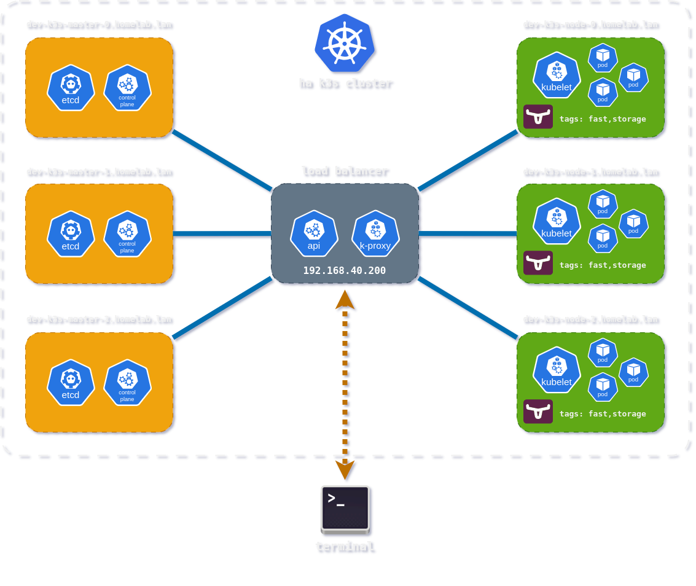

## About the project.

The [k3s-ansible](https://github.com/JacekZubielik/k3s-ansible) repository is a fork of the project [techno-tim/k3s-ansible](https://github.com/techno-tim/k3s-ansible) that allows you to automatically run highly available clusters using `Ansible` and `k3s` along with `MetalLB`, `Flannel`, `Calico`, `Cilium` or `Kube-VIP` of your choice on hybrid **x86\/ARM** nodes in the same cluster on different operating systems.

This release of the repository adds `Makefile` and new (`playbooks\/roles`) **Ansible**, which is a comprehensive solution for preparing the **Kubernetes** environment:

- Update and upgrade the **Debian** operating system by configuring files, managing services and installing packages on each node.

- Integration with **Apt-Cacher**, which acts as a proxy cache for Debian packages, allowing multiple machines to share a local cache.

- Preparation for **Longhorn** deployment, creating partitions, configuring the filesystem, checking requirements, and **labelling** and **annotating** the relevant nodes in the cluster.

- Removal of redundant code (Proxmox LCX support, Proxy, etc.)

The project consists of multiple repositories, deployment is fully automated, the cluster can be redeployed in minutes as many times as required.

## To Do

- install and configure support for NVIDIA and Intel GPUs in Kubernetes clusters.

## Related repositories.

Please check the following repository for more information:

| Name                  | Description                                                              |
| --------------------- | ------------------------------------------------------------------------ |
| [k3s-ansible](https://github.com/JacekZubielik/k3s-ansible)          | Automated build of HA k3s cluster with kube-vip and MetalLB via ansible. |
| [dev-k3s-lab-autopilot](https://github.com/JacekZubielik/dev-k3s-lab-autopilot) | Deploying applications to the clusters with  ArgoCD Autopilot.           |
| [jz-helm-charts](https://github.com/JacekZubielik/jz-helm-charts)        | Personal Helm charts for applications deployed to the clusters           | 
